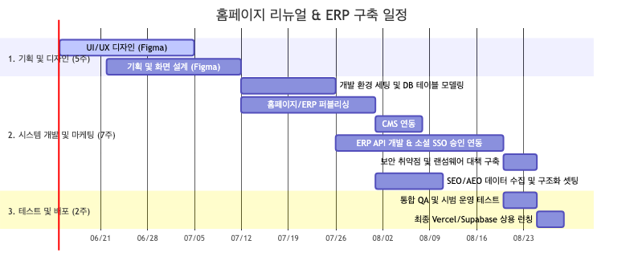

# 견  적  서 (Quotation)

* **견적일자**: 2026년 06월 15일
* **제출처**: (주)그룹환경종합건축사사무소 귀중
* **프로젝트명**: 홈페이지 리뉴얼 & 사내 인트라넷 통합 구축 (SSO 화이트리스트 + SEO/AEO 마케팅 + 보안 강화 아키텍처 적용)

---

## 1. 견적 요약 및 당사자 정보

| 공급받는 자 (고객사) | 공급자 (개발사) |
| :--- | :--- |
| **회사명**: (주)그룹환경종합건축사사무소 | **회사명**: |
| **담당자**: | **담당자**: |
| **연락처**: | **연락처**: |
| **소재지**: 서울시 성동구 뚝섬로1길 25 (성수동) | **소재지**: |

---

> [!IMPORTANT]
> **견적 총액: 일금 육천육백만 원정 (₩ 66,000,000 / 부가가치세 포함)**
> *   **공급가액**: 60,000,000 원
> *   **부가가치세 (10%)**: 6,000,000 원
> *   **특이사항**: **기존 홈페이지 리뉴얼, 데이터 마이그레이션, SEO/AEO 마케팅, 보안 강화 아키텍처 적용 및 정기 협의·진척 현황 보고를 포함한 전담 프로젝트 관리 공수가 최종 확정 반영된 금액입니다.**

---

## 2. 견적 세부 내역서 (공급가액 기준)

※ 본 견적서의 인력 공수 산정은 **1 M/M = 20 영업일 (Working Days)**의 업계 표준 공식이 엄격히 적용되었습니다.

| 번호 | 품명 (구축 범위) | 규격 / 사양 | 공수 (M/M) | 수량 | 단위 | 단가 (원) | 공급가액 (원) | 세액 (원) | 비고 |
| :---: | :--- | :--- | :---: | :---: | :---: | :---: | :---: | :---: | :--- |
| 1 | **기획 및 디자인 부문 (UI/UX 반응형 설계)** | 홈페이지 리뉴얼 및 사내 인트라넷 UI 설계 | **1.00 M/M** | 1 | 식 | 8,000,000 | 8,000,000 | 800,000 | 20일 (Figma 산출물) |
| 2 | **기획 및 화면 설계** | 요구사항 상세 분석, 기획 및 화면 설계 | **1.00 M/M** | 1 | 식 | 8,000,000 | 8,000,000 | 800,000 | 20일 (Figma 산출물) |
| 3 | **공개용 홈페이지 개발 (반응형 및 CMS 연동)** | 모션 UI 구축, 데이터 이관, CMS 연동 | **0.75 M/M** | 1 | 식 | 6,000,000 | 6,000,000 | 600,000 | 15일 (Next.js, CMS) |
| 4 | **사내 인트라넷 소셜 SSO 연동** | 소셜 로그인 및 승인 화이트리스트 API | **0.25 M/M** | 1 | 식 | 2,000,000 | 2,000,000 | 200,000 | 5일 (Supabase Auth) |
| 5 | **사내 인트라넷 (업무일정관리 시스템)** | 스프레드시트 그리드 및 한도 검증 로직 | **0.75 M/M** | 1 | 식 | 6,000,000 | 6,000,000 | 600,000 | 15일 (일일 8H 제한 등) |
| 6 | **사내 인트라넷 (직원용 근태 및 기여도 관리)** | 프로젝트별 기여도 차트 및 히트맵 대시보드 | **0.50 M/M** | 1 | 식 | 4,000,000 | 4,000,000 | 400,000 | 10일 (차트 라이브러리) |
| 7 | **사내 인트라넷 (전자결재 및 사내 게시판)** | 연차/업무 결재선, 출퇴근 로깅, 업무일지 연동 | **1.00 M/M** | 1 | 식 | 8,000,000 | 8,000,000 | 800,000 | 20일 (연동 트리거 포함) |
| 8 | **서버 및 DB 인프라 구축 (보안 최적화)** | Vercel/Supabase 상용 런칭 및 운영 이관 | **0.50 M/M** | 1 | 식 | 4,000,000 | 4,000,000 | 400,000 | 10일 (인프라 셋팅) |
| 9 | **SEO & AEO 마케팅 구축** | 검색엔진 최적화 및 AI 검색 추천 최적화 | **0.50 M/M** | 1 | 식 | 4,000,000 | 4,000,000 | 400,000 | 10일 (JSON-LD, AI 대응) |
| 10 | **보안 취약점 및 랜섬웨어 대책**| 모의 해킹 점검, 백업 및 복구 셋팅 | **0.25 M/M** | 1 | 식 | 2,000,000 | 2,000,000 | 200,000 | 5일 (ZAP스캔, PITR) |
| 11 | **통합/인수 테스트 (QA)** | 상용 배포 전 기능 테스트 시나리오 검수 | **0.25 M/M** | 1 | 식 | 2,000,000 | 2,000,000 | 200,000 | 5일 (QA 전담) |
| 12 | **프로젝트 관리 및 현황 보고**| 고객 정기 미팅 협의, WBS 일정 및 보고 | **0.50 M/M** | 1 | 식 | 4,000,000 | 4,000,000 | 400,000 | 10일분 (3개월 분할 PM) |
| 13 | **초기 설정 및 제경비/기술료** | 소셜 API 키 셋팅, AI 구독료 및 회사 간접비 | **제외** | 1 | 식 | 2,000,000 | 2,000,000 | 200,000 | 실비 및 간접비 |
| **-** | **합계 (Total)** | | **7.25 M/M** | | | | **60,000,000** | **6,000,000** | **66,000,000** |

---

## 3. 세부 기능 명세서 (Scope of Work)

본 계약 범위에 포함된 상세 기능 목록입니다. 본 목록에 기재되지 않은 기능 추가 요구사항은 검수 완료 후 또는 계약 변경을 통해 별도 개발 비용이 청구됩니다.

### 3.1. 공개 홈페이지 (Public Website)
- **메인 페이지**: 반응형 히어로 배너 슬라이더, 카테고리별 비즈니스 영역 카드, 주요 실적(Works) 필터링 그리드, 홍보 카드, 오시는 길(Map API 연동), 푸터 회사 정보.
- **About (회사소개)**: 회사소개, 상세 조직도, 경력/연혁 타임라인, 소속 건축사 및 전문가 프로필 목록.
- **Works (실적 관리)**: 재건축·재개발 정비사업 / 지역주택조합 / 민간개발 정비 목록 검색 및 필터링 조회, 프로젝트별 상세 설명 페이지(이미지 갤러리 슬라이더 및 사업 요약).
- **News (보도자료)**: 사내 주요 소식 및 언론 보도 목록/상세 보기 게시판.
- **Contact (고객 문의)**: 제휴 및 설계 의뢰 문의 작성 폼 (보안 문자 입력 방지 및 접수 시 관리자 이메일 자동 발송 연동).

### 3.2. 홈페이지 관리자 시스템 (CMS)
- **실적 포트폴리오 관리**: 카테고리 지정, 썸네일 이미지 및 갤러리 다중 업로드, 상세 텍스트(소재지, 규모, 기여도) 입력, 프로젝트 신규 등록/수정/삭제.
- **공지 및 보도자료 관리**: 에디터 기반 게시글 작성, 대표 이미지 등록 및 발행 일자 편집.
- **문의 내역 조회**: Contact 폼을 통해 접수된 의뢰 목록 및 신청 데이터 확인.

### 3.3. 사내 인트라넷 시스템 개발 (전자결재/PM/일정)
- **계정 인증 및 접근 제어**: Google / Microsoft 365 소셜 SSO 로그인 지원, 관리자가 등록한 메일 주소만 가입/로그인 가능(화이트리스트 차단 필터).
- **통합 대시보드**: 개인 근태 퀵 체크인/체크아웃 버튼, 금일 출근자 통계 현황, 미결재 대기 배지 수량, 사내 최신 공지사항 연동.
- **투입시간 관리 (Timesheet - A항목)**: 
  - 월 단위 날짜별(1~31일) × 프로젝트별 투입시간 입력 그리드.
  - 하루 투입시간 합계 **8시간 초과 입력 제한**.
  - 월간 누적 합계가 **1.0 M/M (176시간) 초과 시 제출 제한** 및 마감 버튼 비활성화.
  - 마감 제출 시 수정 잠금(Lock) 및 본인 수정 불가 상태 처리.
- **인력 투입 분석 (Manpower - B항목)**:
  - PM 및 관리자 뷰에서 직원별/프로젝트별 투입 현황 목록 모드 전환.
  - 월 총근무시간 대비 프로젝트별 기여 비율(%) 누적 바 차트 시각화.
  - 일별 투입 강도 캘린더 히트맵(요일/날짜별 음영 세분화 단계 표시).
  - 자동 계산 M/M 정보 조회 및 PM의 확정 M/M 직접 입력/승인 저장 처리.
- **전자결재 (E-Approval)**:
  - 기안 작성 폼(연차/반차 신청서, 출장 신청서, 주간 업무보고서 기본 3종 지원).
  - 결재 상태 전이(기안 상신 -> 결재 대기 -> 결재 완료/반려)에 따른 결재 상태 이력 추적.
- **근태 및 업무일지**: 
  - 출근/퇴근 타임스탬프 기록 및 개인 월간 근태 기록표 조회.
  - 주간 업무일지 작성(프로젝트별 시간 입력 시 Timesheet 데이터와 자동 동기화 매핑).
- **사내 게시판**: 공지사항 게시판(쓰기 권한 관리자 제한), 자유게시판(전 사원 글/댓글 소통).

### 3.4. 사내 인트라넷 시스템 설정 및 마스터 관리 (Admin Panel)
- **사원 관리**: 신규 사원 이메일(SSO 연동용) 등록, 부서 배정, 직급 관리.
- **권한 관리**: 일반 사원 / PM(M/M 확정 및 결재 권한) / 시스템 관리자 차등 권한 부여.
- **프로젝트 관리**: 신규 프로젝트 등록, 담당 PM 지정, 프로젝트 활성화/비활성화 상태 전환.

### 3.5. 화면 설계 기준 목록 (총 15본 템플릿)
*본 견적에 포함된 핵심 화면 15본의 목록이며, 반응형(PC/Mobile/Tablet) 파생 화면은 이 15본을 기준으로 설계됩니다.*
* **[공개 홈페이지 - 5본]**: ① 메인 홈, ② 회사 소개(조직도/연혁), ③ 실적 포트폴리오 목록(검색/필터), ④ 실적 상세 보기, ⑤ 보도자료 및 문의 폼(Contact)
* **[사내 인트라넷 및 관리자 - 10본]**: ⑥ 로그인/접속 대기, ⑦ 통합 대시보드, ⑧ 타임시트 입력/마감, ⑨ 인력 투입(M/M) 통계 차트, ⑩ 전자결재 기안 및 목록, ⑪ 개인 근태 및 주간 업무일지, ⑫ 사내 소통 게시판, ⑬ 사원/권한 관리(Admin), ⑭ 프로젝트 상태 관리(Admin), ⑮ 홈페이지 실적/보도자료 관리(CMS)

---

## 4. 견적 조건 (Terms & Conditions)

1.  **납품 기한**: 계약일로부터 **12주 (약 3개월)** 이내 (디자인 외주 개발 완료일 포함)
2.  **화면수(Page) 산정 기준**: 본 견적의 디자인 및 퍼블리싱 공수는 **총 15개 핵심 템플릿 화면 (공개 홈페이지 5본, 사내 인트라넷 및 관리자 10본)**을 기준으로 산출되었습니다. (PC/모바일 반응형 파생 시안 포함 시 약 30여 종 내외). 명세서에 기재되지 않은 신규 화면(기능) 추가 요청 시, 1본당 별도의 UI/UX 설계 및 프론트엔드 추가 개발 비용이 청구됩니다.
3.  **대금 지급 조건**:
    *   **계약금**: 30% (계약 시 지급) — 디자인 착수 및 개발 환경 셋팅
    *   **중도금**: 40% (W7차, 홈페이지 및 사내 인트라넷 프론트엔드 퍼블리싱 가이드 완료 시)
    *   **잔금**: 30% (최종 검수 및 Vercel/Supabase 운영 서버 이관 완료 시)
4.  **견적 유효기간**: 본 견적서 제출일로부터 **30일** 이내
5.  **기타 유의사항**:
    *   Vercel, Supabase 등 클라우드 월 사용료는 고객사 실비 부담(월 약 6~7만 원 예상)입니다.
    *   무상 하자 보수 보증 기간은 최종 이관 완료일로부터 **6개월**간 제공됩니다. (단, 추가 기능 개발 요청은 별도 계약 필요)

---

## 5. WBS 세부 추진 일정 (업무분업구조)

---

## 6. 품명별 비용 및 일정 산출의 구체적 근거

본 프로젝트의 모든 견적 금액과 일정은 기능 명세서의 개발 난이도와 직무별 표준 단가를 바탕으로 객관적으로 산출되었습니다.

### 6.1. 기획 및 디자인 부문 (UI/UX 반응형 설계) (8,000,000 원 / 일정: 20일) - **[1.00 M/M]**
- **산출 근거**: 공개 홈페이지 5개 템플릿과 사내 인트라넷 내부 10개 템플릿(반응형 포함 실질 시안 30여 개)의 레이아웃 디자인 설계 예산입니다. 브랜드 톤앤매너 설정(2종), 시안 검수 피드백(2회) 및 개발에 즉시 활용 가능한 피그마(Figma) 반응형 가이드북 구축 공수(1.00 M/M = 20 영업일)가 적용되었습니다. (디자인 인력은 사내 인력 혹은 외부 전문가 등 진행 방식 추후 결정)

### 6.2. 기획 및 화면 설계 (8,000,000 원 / 일정: 20일) - **[1.00 M/M]**
- **산출 근거**: 프로젝트 시작 단계에서 요구사항을 분석하여 데이터베이스 논리/물리 설계 및 구조를 완성하고, 디자인 가이드를 위한 화면 설계서(Wireframe)를 피그마(Figma) 산출물 형태로 상세 기획하여 개발 청사진을 제공하는 공수(1.00 M/M = 20 영업일)입니다.

### 6.3. 공개용 홈페이지 개발 (반응형 및 CMS 연동) (6,000,000 원 / 일정: 15일) - **[0.75 M/M]**
- **산출 근거**: Next.js 기반의 무중단 반응형 마크업 코딩과 Framer Motion 프레임워크를 연동한 스무스 웹 인터랙션 구현 비용입니다. 기존 사이트(`aeg-hk.com`)에 보관 중인 30여 개 이상의 기존 프로젝트 실적 이미지 및 텍스트 데이터의 유실 없는 Supabase DB 마이그레이션 이전 작업, 그리고 301 SEO 리다이렉트 라우팅 셋팅 공수(0.75 M/M = 15 영업일)가 반영되었습니다.

### 6.4. 사내 인트라넷 소셜 SSO 연동 (2,000,000 원 / 일정: 5일) - **[0.25 M/M]**
- **산출 근거**: 구글 및 MS 365 OpenID Connect API 연동 모듈을 구현하여 로그인 편의성을 극대화합니다. 회사 내부 보안을 위한 핵심 로직으로, 관리자 DB에 사전 수동 등록된 메일(화이트리스트)만 로그인을 허용하고 이외 계정의 사내 인트라넷 진입 시 비인가 접근 경고 화면을 노출하는 필터 로직 개발 공수(0.25 M/M = 5 영업일)입니다.

### 6.5. 사내 인트라넷 (업무일정관리 시스템) (6,000,000 원 / 일정: 15일) - **[0.75 M/M]**
- **산출 근거**: 본 시스템의 핵심 비즈니스 로직으로, 행(프로젝트)×열(날짜 1~31일) 구성의 가로형 스프레드시트 컴포넌트 개발 공수입니다. 클라이언트 스크립트와 서버 API 2중으로 '일일 최대 8H 입력 제한', '월 총합 176H 초과 제출 차단'을 정밀 검증하고, 마감 버튼을 통한 제출 잠금 및 PM 승인을 통한 잠금 해제 기능 개발에 총 0.75 M/M (= 15 영업일)이 투입됩니다.

### 6.6. 사내 인트라넷 (직원용 근태 및 기여도 관리) (4,000,000 원 / 일정: 10일) - **[0.50 M/M]**
- **산출 근거**: DB(timesheet_daily, timesheet_monthly)로부터 데이터를 실시간 조회하여 '직원별' 및 '프로젝트별' 투입 비중을 다차원 연산하는 쿼리 최적화 비용입니다. 가로 누적 기여도 바 차트 및 요일별 음영 밀도를 시각적으로 보여주는 캘린더 히트맵(SVG 컴포넌트 기반) 차트 연동, 그리고 PM 전용의 확정 M/M 직접 기입 및 승인 기능 구현을 위해 0.50 M/M (= 10 영업일)이 투입됩니다.

### 6.7. 사내 인트라넷 (전자결재 및 사내 게시판) (8,000,000 원 / 일정: 20일) - **[1.00 M/M]**
- **산출 근거**: 연차원/출장신청/업무보고 등 결재 양식 3종 및 기안-대기-완료/반려 상태 전이 워크플로우를 구현합니다. 대시보드 퀵 체크인 버튼을 통한 실시간 출퇴근 스탬프 로깅 및 월간 근태 테이블을 구현하고, 주간 업무일지 작성 컴포넌트에서 입력한 프로젝트별 소요시간 데이터가 타임시트 데이터 테이블에 실시간 동기화되는 트리거 연동 개발을 위해 1.00 M/M (= 20 영업일)의 공수가 집중 투입됩니다.

### 6.8. 서버 및 DB 인프라 구축 (보안 최적화) (4,000,000 원 / 일정: 10일) - **[0.50 M/M]**
- **산출 근거**: Vercel 프로덕션 도메인 셋팅 및 자동 빌드/배포(CI/CD) 파이프라인 구성, Supabase 클라우드 인프라(DB, Auth, Storage) 실 운영 셋팅, 파일 저장용 클라우드 보안 토큰 세팅 및 최종 도메인 네임서버 연동 등 무중단 24시간 가동이 가능한 인프라 아키텍처 구축에 0.50 M/M (= 10 영업일)이 투입됩니다.

### 6.9. SEO & AEO 마케팅 구축 (4,000,000 원 / 일정: 10일) - **[0.50 M/M]**
- **산출 근거**: 네이버/구글 색인용 JSON-LD 스키마 마크업 설계 및 웹마스터 등록 등 Technical SEO, AI 검색(ChatGPT, Gemini 등) 답변 추천에 우선 포지셔닝 되도록 LLM 친화적 문서 배치를 설계하는 AEO 최적화, 네이버 스마트플레이스/구글 맵 지리 정보 등록 등 Local SEO 설정을 위한 통합 기획/엔지니어링 공수(0.50 M/M = 10 영업일)가 포함되었습니다.

### 6.10. 보안 취약점 및 랜섬웨어 대책 (2,000,000 원 / 일정: 5일) - **[0.25 M/M]**
- **산출 근거**: OWASP ZAP 보안 점검 툴을 연동하여 웹 취약점(SQL Injection, XSS, 세션 인증) 모의 해킹 및 탐지를 수행하고, 비인가 접근을 완전 차단하는 데이터베이스 RLS 규칙을 코딩합니다. 더불어 데이터 훼손 시 원하는 초(Second) 단위 상태로 롤백이 가능하도록 PostgreSQL 시점 복구(PITR) 서버를 구축하고, 저장소 파일 암호화 방지를 위한 다중 스토리지 보안 정책을 검증하는 전담 보안 엔지니어링 공수(0.25 M/M = 5 영업일)가 적용되었습니다.

### 6.11. 통합/인수 테스트 (QA) (2,000,000 원 / 일정: 5일) - **[0.25 M/M]**
- **산출 근거**: 개발이 완료된 후 상용 서버에 배포하기 전, 사용자의 관점에서 사내 인트라넷의 전체 워크플로우(근태 체크, 결재 승인, 타임시트 작성 등)와 홈페이지의 주요 기능을 점검하는 통합 테스트 시나리오 수행 공수입니다. 버그 리포팅 및 검수 보완 작업을 위해 QA 전담 인력의 공수(0.25 M/M = 5 영업일)가 산정되었습니다.

### 6.12. 프로젝트 관리 및 현황 보고 (4,000,000 원 / 일정: 10일 - 3개월 분배) - **[0.50 M/M]**
- **산출 근거**: 12주 프로젝트 기간 동안 고객사와의 주간 정기 미팅 및 수시 요건 조율(PM 미팅), 개발 WBS 일정 지연 모니터링 및 리스크 제어, 매주 주간 업무 보고서와 매월 월간 현황 보고서 작성을 통한 프로젝트 현황 시각화 리포팅을 지원하는 PM(Project Manager) 전담 관리 공수(총 투입 노력 0.50 M/M = 10 영업일분 분산 투입)입니다.

### 6.13. 초기 설정 및 제경비/기술료 (2,000,000 원 / 일정: 일회성) - **[M/M 제외]**
- **산출 근거**: 소셜 SSO 로그인 연동을 위한 API 키 발급 및 초기 웹서버 인스턴스 세팅비 등 개발에 필요한 초기 인프라 셋팅 실비와 소프트웨어 기술 라이선스(Figma 등) 이용, AI 구독료 및 회사 간접비를 종합 산정한 고정 비용입니다. (실비 및 간접비 성격이므로 M/M 산정에서는 제외합니다.)

---

## 7. 보안 취약점 점검 및 랜섬웨어 대책 상세 계획

최근 해킹 및 랜섬웨어 공격이 고도화됨에 따라, 본 프로젝트에서는 개발 완료 단계에서 시스템 보안을 강화하고 감염 피해를 원천 차단하기 위한 3단계 보안 구축 및 검증을 실시합니다.

### 7.1. 웹 애플리케이션 취약점 모의 테스트 (OWASP Top 10 대응)
- **SQL Injection 원천 차단 검증**: Supabase Client 및 PostgreSQL 내장 PostgREST는 모든 입력값을 SQL 바인딩 파라미터로 처리하여 SQL 인젝션을 물리적으로 불가능하게 차단합니다. 백엔드(Server Actions) 커스텀 쿼리에 대해 전수 코드 감사를 실시합니다.
- **XSS (Cross-Site Scripting) 필터링**: Next.js는 기본적으로 웹 렌더링 시 HTML 문자를 이스케이프(Escape) 처리합니다. 사용자가 풍부한 텍스트 입력을 처리하는 CMS 에디터 본문에는 `DOMPurify` 보안 패키지를 탑재하여 스크립트 실행 태그를 100% 필터링하는 모의 침투를 시도합니다.
- **권한 우회 접속 (Broken Access Control) 검증**: Supabase의 핵심 보안 엔진인 **RLS(Row-Level Security, 행 수준 보안)**를 활성화합니다. 데이터베이스 단에서 "로그인 사용자 세션 정보"와 "해당 레코드의 소유자(Owner) 정보"가 일치할 때만 조회/수정 권한을 주는 쿼리 가드를 구축하고, 프론트엔드를 통하지 않고 직접 API 엔드포인트를 호출하여 권한이 없는 타인의 데이터를 탈취하려는 우회 공격을 가상으로 시도하여 차단 여부를 검증합니다.

### 7.2. 랜섬웨어(Ransomware) 감염 차단 및 백업·복구 아키텍처
기존 사내 구축형(On-Premise) NAS나 웹서버는 해커가 OS 루트 권한을 획득하면 전체 드라이브 파일을 암호화하는 랜섬웨어에 매우 취약합니다. 본 프로젝트는 클라우드 서버리스 아키텍처를 도입하여 이러한 인프라 감염 경로를 원천 차단합니다.

- **샌드박스형 서버리스 배포 (Vercel)**: Next.js 코드는 Vercel의 관리형 엣지 서버리스 함수 형태로 실행됩니다. 해커가 침입해 파일을 악의적으로 설치하거나 OS 디렉토리를 통째로 잠그는 물리적 서버 기반 랜섬웨어의 실행 공간 자체가 존재하지 않습니다.
- **클라우드 데이터베이스 실시간 시점 복구 (PITR)**: Supabase PostgreSQL은 매일 전체 자동 백업이 수행되며, 실시간 트랜잭션 로그를 기록합니다. 혹여 내부자 탈취나 관리자 계정 유출 등으로 고의적인 DB 훼손이 발생할 경우, 피해 발생 1초 전 상태 등 **원하는 시점으로 데이터를 되돌릴 수 있는 시점 복구(Point-in-Time Recovery)** 체계를 구축하고 복구 시뮬레이션 테스트를 수행합니다.
- **스토리지(NAS 대체) 다중 백업 및 변경 불가 규칙**: 결재용 파일 및 업로드 실적 이미지가 보관되는 Supabase Storage는 물리적으로 격리된 고내구성 스토리지 서버에 분산 저장됩니다. 스토리지 파일 삭제/수정 요청은 엄격한 백엔드 API RLS 규칙을 거치게 되며, 훼손 방지를 위한 내부 영구 보관 정책을 설정하여 랜섬웨어에 의한 암호화 행위를 방지합니다.

### 7.3. 자동화 보안 진단 도구 가동 및 검수 기준
- **OWASP ZAP 취약점 자동 정밀 스캔**: 개발 완료 및 상용 배포 직전 단계에서 글로벌 표준 웹 취약점 스캐너인 **OWASP ZAP (Zed Attack Proxy)**을 가동하여 시스템을 스캔합니다. 검출된 리포트를 바탕으로 위험 취약점(High & Medium Vulnerability)을 **Zero (0건)** 상태로 조치한 결과 보고서를 고객사에 전달하고 배포를 진행합니다.
- **npm audit 의존성 보안 진단**: 개발에 사용된 라이브러리 및 종속성 패키지 중에서 알려진 보안 취약점(CVE)이 매칭되어 있는지 분석하고, 발견 시 최신 보안 패치 버전으로 일괄 업데이트를 적용하여 침투 경로를 선제 차단합니다.
- **민감 비밀 키 노출 방지**: GitHub 등 외부에 API Key, 데이터베이스 접근 정보 등이 유출되는 것을 차단하기 위해, 코드 내부에는 어떠한 비밀번호도 기재하지 않으며 모든 민감 설정은 Vercel/Supabase의 환경 변수(Encrypted Env Variables)에 암호화하여 관리합니다.
