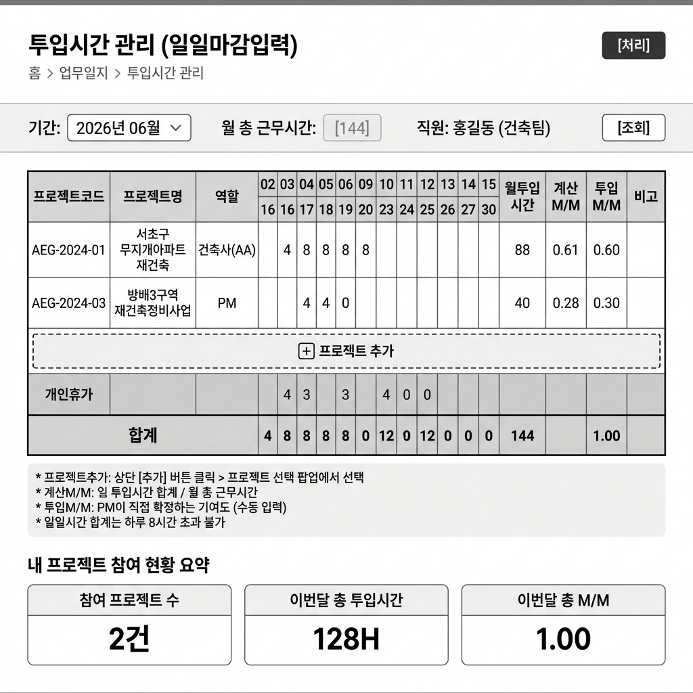
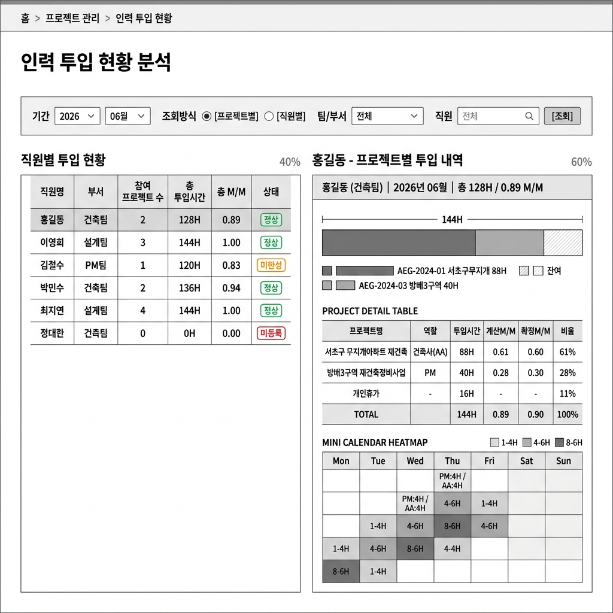
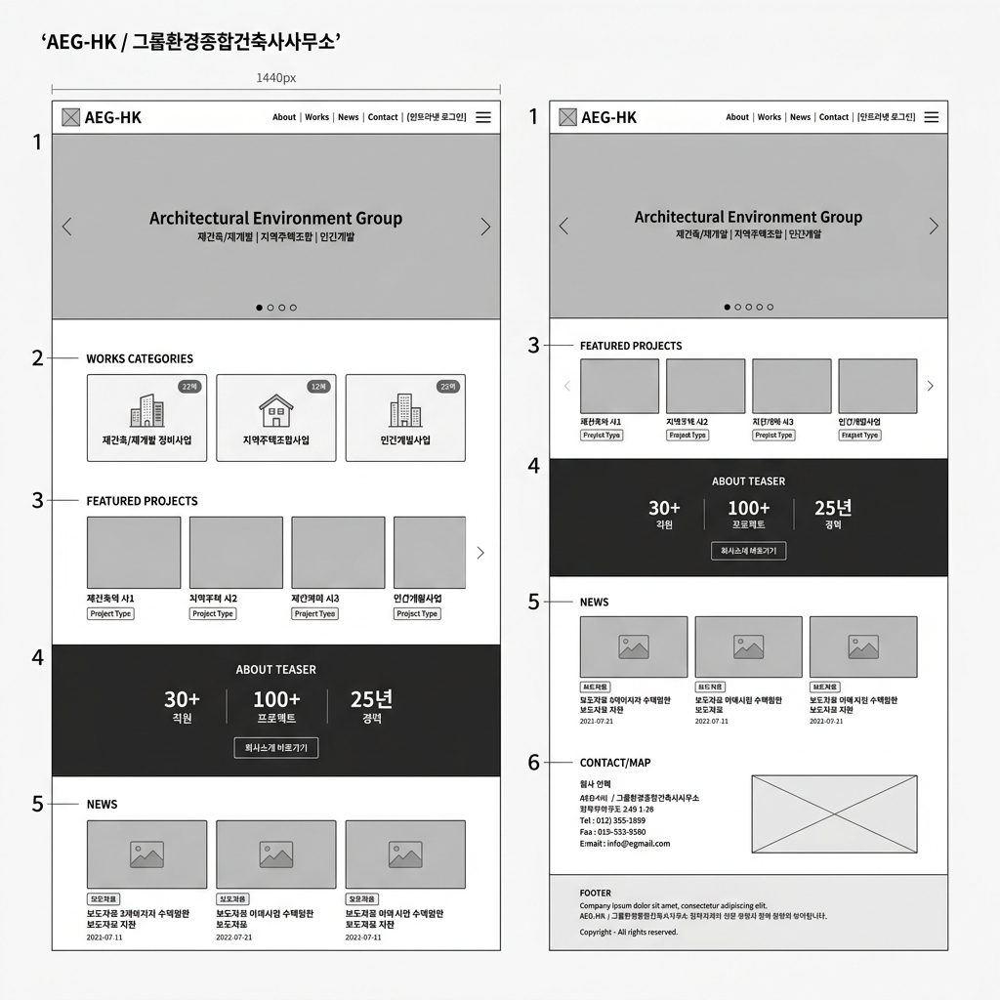
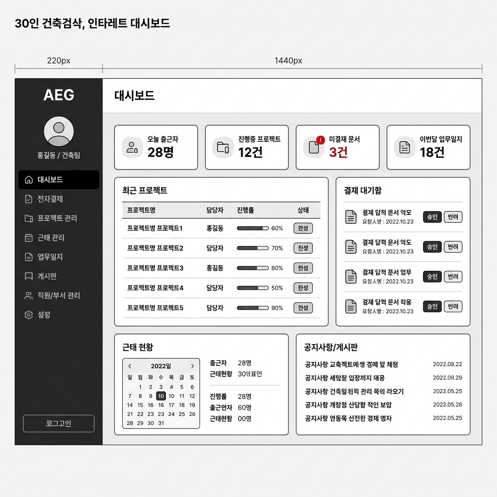
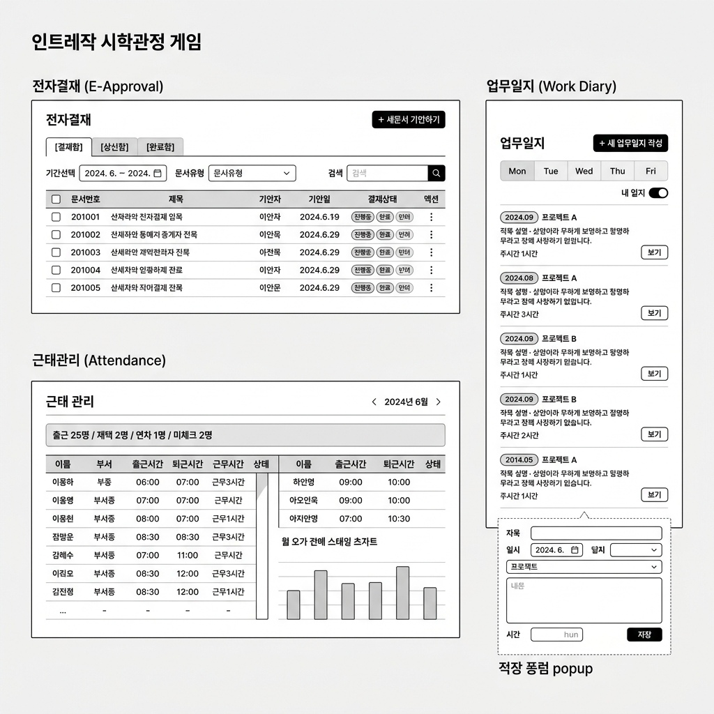
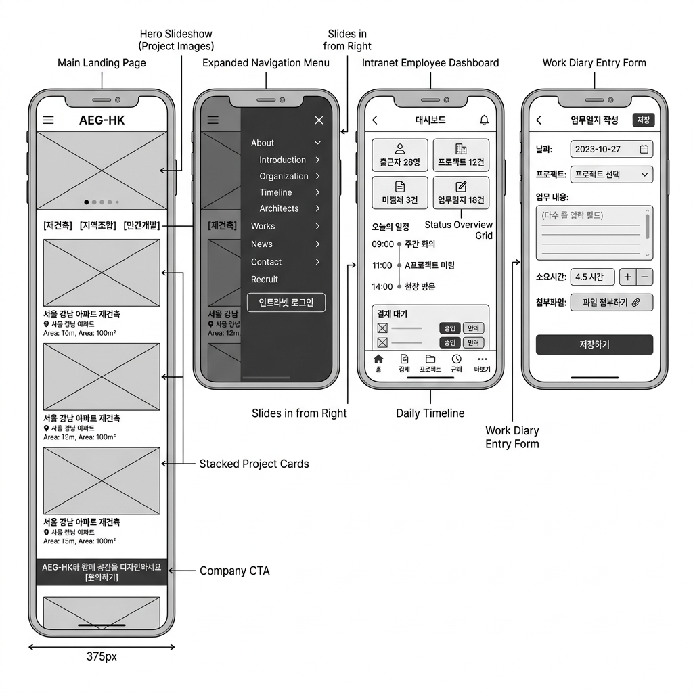

# AEG-HK 홈페이지 & 인트라넷 통합 구축 — 와이어프레임

> **㈜그룹환경종합건축사사무소** | 건축관련기술서비스업, 임대, 부동산개발  
> 직원 약 30명 | 개발 범위: 공개 홈페이지 + 사내 인트라넷

---

## ✨ 신규 추가: 프로젝트 다중 참여 투입시간 관리

> **핵심 요구사항**: 직원 1명이 여러 프로젝트에 동시 참여 → 날짜별 투입시간 기록 → 프로젝트·인력별 기여도(M/M) 자동 계산

---

## A. 투입시간 관리 — 일일마감입력 (직원 본인 뷰)



### 화면 구성

| 구성요소 | 설명 |
|----------|------|
| **기간 선택** | 연/월 드롭다운으로 조회 월 선택 |
| **월 총 근무시간** | 해당 월 기준 근무시간 (기본 144H, 수정 가능) |
| **일별 × 프로젝트 그리드** | 행=프로젝트, 열=날짜(영업일), 셀=투입시간(H) 직접 입력 |
| **[+ 프로젝트 추가]** | 점선 버튼으로 참여 프로젝트 추가 (팝업 선택) |
| **개인휴가 행** | 연차/반차 처리 별도 행으로 관리 |
| **합계 행** | 일별 합산이 월 총 근무시간 초과 시 오류 표시 |
| **계산 M/M** | 월투입시간 ÷ 월총근무시간 (자동 계산) |
| **확정 M/M** | PM이 최종 승인·조정하는 기여도 (수동 입력) |
| **[처리] 버튼** | 월 마감 처리 → 이후 수정 잠금 |

### 비즈니스 규칙

- 하루 투입시간 합계 **8시간 초과 불가** (초과 시 빨간색 경고)
- 합계 행이 **월 총 근무시간과 불일치** 시 저장 경고
- 월 마감 후 **직원 수정 불가** → PM 승인으로만 수정
- 프로젝트 추가 팝업: 현재 본인이 **배정된 프로젝트만** 선택 가능

---

## B. 인력 투입 현황 분석 (관리자/PM 뷰)



### 화면 구성

**좌측 패널 — 직원별 투입 현황 목록**

| 컬럼 | 설명 |
|------|------|
| 직원명 / 부서 | 클릭 시 우측 패널 갱신 |
| 참여 프로젝트 수 | 해당 월 투입 기록이 있는 프로젝트 수 |
| 총 투입시간 | 전체 프로젝트 합산 |
| 총 M/M | 확정 M/M 합계 |
| 상태 배지 | 🟢 정상 / 🟡 미완성(미마감) / 🔴 미등록 |

**우측 패널 — 선택 직원 상세 (홍길동 예시)**

1. **가로 누적 바 차트**: 월 총 근무시간 대비 프로젝트별 투입시간 비율 시각화
2. **프로젝트 상세 테이블**: 프로젝트명 · 역할 · 투입시간 · 계산M/M · 확정M/M · 비율
3. **캘린더 히트맵**: 날짜별 투입 강도를 음영으로 표시, 분할 근무일은 `PM:4H / AA:4H` 라벨

### 조회 방식 전환

| 조회 방식 | 설명 |
|-----------|------|
| **직원별** | 한 명의 직원이 여러 프로젝트에 얼마나 참여했는지 |
| **프로젝트별** | 한 프로젝트에 어떤 직원이 얼마나 투입됐는지 (역방향 조회) |

> [!TIP]
> **프로젝트별 조회** 시: 행=직원, 열=날짜 형태의 그리드로 전환되어  
> 특정 프로젝트의 월별 누적 M/M 및 직원별 기여율(%)을 한눈에 파악 가능

---

## C. 데이터 흐름 구조

```
직원 (매월)
  └─ 투입시간 입력 (일일마감입력)
        ├─ 프로젝트A: 날짜별 H 기록
        ├─ 프로젝트B: 날짜별 H 기록
        └─ 개인휴가: 날짜별 기록

PM (검토/승인)
  └─ 확정 M/M 입력 및 월 마감 처리

관리자 (분석)
  ├─ 직원별 조회: 특정 인력의 프로젝트 참여 이력
  └─ 프로젝트별 조회: 특정 프로젝트의 인력 투입 현황
```

---

## D. DB 설계 핵심 테이블 (참고)

```sql
-- 직원의 날짜별 × 프로젝트별 투입시간
CREATE TABLE timesheet_daily (
  id           INT PRIMARY KEY AUTO_INCREMENT,
  employee_id  INT NOT NULL,       -- 직원
  project_id   INT NOT NULL,       -- 프로젝트
  work_date    DATE NOT NULL,      -- 날짜
  hours        DECIMAL(4,1),       -- 투입시간 (ex. 4.0, 8.0)
  is_vacation  BOOLEAN DEFAULT 0,  -- 휴가 여부
  created_at   TIMESTAMP,
  UNIQUE KEY uq_emp_proj_date (employee_id, project_id, work_date)
);

-- 월별 마감 M/M 확정
CREATE TABLE timesheet_monthly (
  id              INT PRIMARY KEY AUTO_INCREMENT,
  employee_id     INT NOT NULL,
  project_id      INT NOT NULL,
  year_month      CHAR(7),          -- '2026-06'
  total_hours     DECIMAL(6,1),     -- 월 투입시간 합계
  calc_mm         DECIMAL(5,3),     -- 계산 M/M
  confirm_mm      DECIMAL(5,3),     -- 확정 M/M (PM 입력)
  is_closed       BOOLEAN DEFAULT 0,-- 마감 여부
  closed_by       INT,              -- 마감 처리자 (PM)
  closed_at       TIMESTAMP
);
```

---

---

## 1. 공개 홈페이지 (PC Desktop — 1440px)



### 화면 구성 (위→아래)

| 섹션 | 주요 요소 |
|------|-----------|
| **Header** | 로고(AEG-HK) / GNB 메뉴(About · Works · News · Contact) / 인트라넷 로그인 버튼 |
| **① Hero Slider** | 전체 화면 슬라이드(프로젝트 대표 이미지 5장) / 이전·다음 화살표 / 슬라이드 도트 |
| **② Works Categories** | 3컬럼 카드: 재건축·재개발 정비사업 / 지역주택조합사업 / 민간개발사업 (프로젝트 건수 배지) |
| **③ Featured Projects** | 가로 스크롤 프로젝트 그리드 (이미지 + 프로젝트명 + 유형 태그) |
| **④ About Teaser** | 다크 배경 / 30+ 직원 · 100+ 프로젝트 · 25년 경력 / 회사소개 바로가기 CTA |
| **⑤ News** | 3컬럼 뉴스 카드 (썸네일 + 카테고리 태그 + 제목 + 날짜) |
| **⑥ Contact & Map** | 좌: 주소·전화·팩스·이메일 / 우: 카카오맵 영역 |
| **Footer** | 회사정보 · 사업자번호 · 저작권 · 인트라넷 링크 |

---

## 2. 사내 인트라넷 — 대시보드 (PC Desktop)



### 레이아웃 구성

**좌측 사이드바 (220px 고정)**
- AEG 로고
- 로그인 사용자 프로필 (아바타 + 이름/부서)
- 메뉴: 대시보드 / 전자결재 / 프로젝트 관리 / 근태 관리 / 업무일지 / 게시판 / 직원·부서 관리 / 설정
- 로그아웃

**메인 콘텐츠 — 대시보드**

| 영역 | 내용 |
|------|------|
| **상단 통계 카드 (4개)** | 오늘 출근자 · 진행중 프로젝트 · 미결재 문서(빨간 배지) · 이번달 업무일지 |
| **중단 좌 — 최근 프로젝트** | 프로젝트명 / 담당자 / 진행률(바) / 상태 테이블 |
| **중단 우 — 결재 대기함** | 문서 목록 + 승인/반려 버튼 |
| **하단 좌 — 근태 현황** | 미니 캘린더 + 출근 현황 요약 |
| **하단 우 — 공지사항** | 게시물 5건 목록 |

---

## 3. 인트라넷 서브 페이지 (전자결재 / 근태관리 / 업무일지)



### 전자결재 (E-Approval)
- 탭: 결재함 / 상신함 / 완료함
- 필터: 기간 선택 · 문서유형 · 검색
- 테이블: 문서번호 · 제목 · 기안자 · 기안일 · 결재상태(진행중/완료/반려) · 액션
- [새문서 기안하기] 버튼

### 근태 관리 (Attendance)
- 월 단위 이동 네비게이터
- 요약 바: 출근/재택/연차/미체크 인원
- 직원 근태 테이블: 이름 · 부서 · 출근·퇴근시간 · 근무시간 · 상태
- 월간 초과근무 차트

### 업무일지 (Work Diary)
- 주간 뷰 탭 (월~금)
- 일지 목록: 날짜 칩 · 프로젝트명 · 내용 요약 · 소요시간 · [보기]
- 작성 팝업: 제목 · 날짜 · 프로젝트 선택 · 내용 · 시간 입력

---

## 4. 모바일 반응형 (375px)



| 화면 | 설명 |
|------|------|
| **모바일 홈페이지** | 햄버거 메뉴 / 전체폭 히어로 슬라이더 / 카테고리 탭 / 세로 스크롤 프로젝트 카드 |
| **모바일 네비게이션** | 우측에서 슬라이드인 / 계층형 메뉴 / 인트라넷 로그인 버튼 강조 |
| **모바일 인트라넷 대시보드** | 2×2 통계 카드 / 오늘의 일정 타임라인 / 결재 대기 카드 / 하단 탭 바 |
| **업무일지 작성 폼** | 날짜·프로젝트·내용·소요시간·파일첨부 필드 / [저장하기] CTA |

---

## 5. 사이트맵 요약

```
공개 홈페이지
├── 메인 (/)
├── About
│   ├── Introduction (회사소개)
│   ├── Organization (조직도)
│   ├── Timeline (연혁)
│   └── Architects (건축사 소개)
├── Works (포트폴리오)
│   ├── 재건축/재개발
│   ├── 지역주택조합
│   └── 민간개발
├── News (보도자료/소식)
└── Contact
    ├── Contact Us (오시는 길)
    └── Recruit (채용)

사내 인트라넷 (로그인 필요)
├── 대시보드
├── 전자결재
│   ├── 결재함
│   ├── 상신함
│   └── 완료함
├── 프로젝트 관리
│   ├── 프로젝트 목록
│   ├── 프로젝트 상세/Gantt
│   └── 프로젝트 등록
├── 근태 관리
│   ├── 출퇴근 체크
│   ├── 직원별 근태 현황
│   └── 연차/휴가 관리
├── 업무일지
│   ├── 내 일지
│   └── 팀 일지 (관리자)
├── 게시판
│   ├── 공지사항
│   └── 자유게시판
└── 직원/부서 관리 (관리자)
    ├── 직원 목록/등록
    ├── 부서 관리
    └── 권한 설정
```

---

## 6. 기술 스택 제안 (개발 의뢰서 기반)

| 영역 | 기술 |
|------|------|
| **서버** | Linux + Apache |
| **백엔드** | PHP (공개 홈페이지 CMS 연동) |
| **데이터베이스** | MySQL (관계형 DB) |
| **프론트엔드** | 반응형 퍼블리싱 (HTML/CSS/JS) |
| **CMS** | 관리자 페이지 연동 |
| **보안** | Firewall 규칙 + 포트 차단 |

> [!NOTE]
> 본 와이어프레임은 개발 범위 확인 및 피드백을 위한 초안입니다. 디자인 톤앤매너, 컬러 시스템, 세부 기능 요구사항은 추가 협의 후 확정합니다.

> [!IMPORTANT]
> **인트라넷 접근 정책**: 현재 `aeghk.quickconnect.to` (Synology NAS)를 사용 중인 것으로 확인됩니다. 새 인트라넷 시스템과의 연계 방식을 별도 협의 필요합니다.
